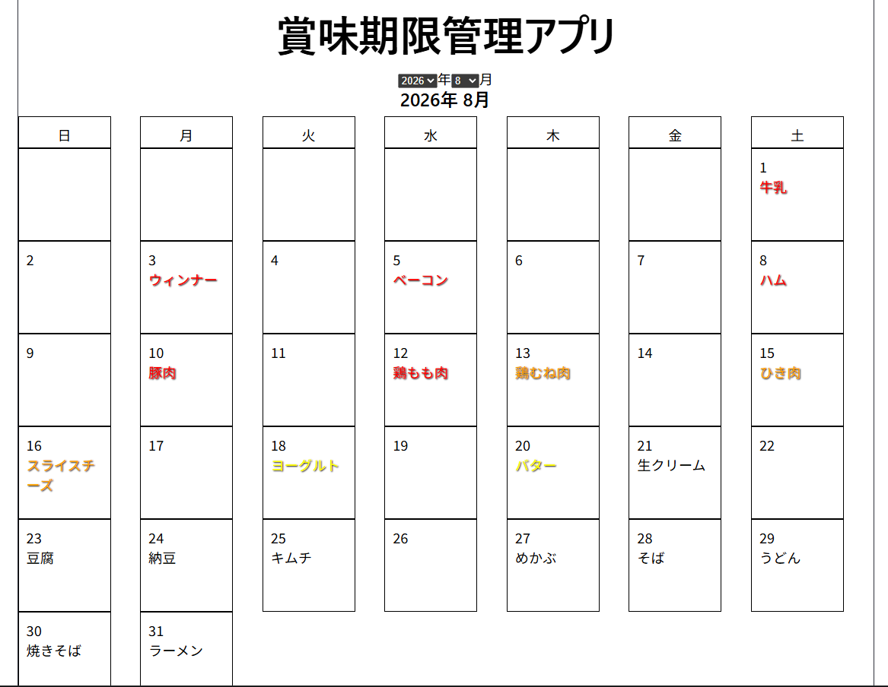

# 賞味期限管理アプリ

商品の賞味期限をカレンダー形式で管理するWebアプリです。

## スクリーンショット



## 機能

- カレンダー形式で賞味期限を表示
- 年・月の切り替え
- 賞味期限までの日数に応じた色分け
  - 当日・期限切れ：赤
  - 3日以内：オレンジ
  - 7日以内：黄色

## 使用技術

[](https://react.dev/)
[](https://www.typescriptlang.org/)
[](https://vite.dev/)

## 工夫した点

- 日付計算処理を関数として分離
- 年月選択UIをDateSelectorコンポーネントとして分離
- 賞味期限までの日数に応じて視覚的に確認できるよう色分け

## 今後実装予定

- 商品の追加
- 商品の編集・削除
- データの永続化

## 起動方法

```bash
npm install
npm run dev